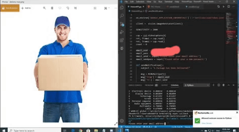
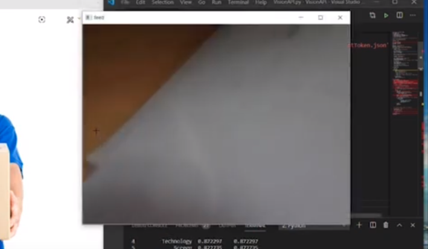
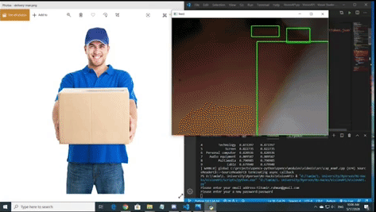
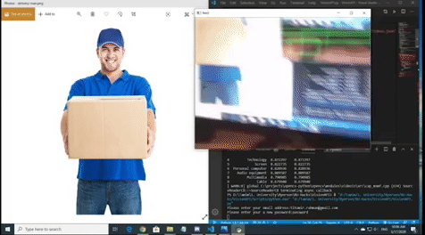
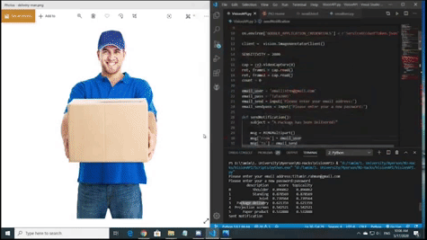

# Computer Vision aided Contactless Delivery 
> This project aims to aid contactless delivery in ensuring the customer experience is not affected from this sudden change in policy. Through the implementation of computer vision, we are able to decrease delivery time and increase parcel security. 

> Couriers will not have to knock and wait at the door for response. This results in faster delivery times for the customer.

> Delivery packages will have a lower chance of being left unattended. Customers are reassured that their package will not be left open to theft. 

## Table of Contents
- [Computer Vision aided Contactless Delivery](#computer-vision-aided-contactless-delivery)
  - [Table of Contents](#table-of-contents)
  - [How it works...](#how-it-works)
    - [1. Enter the email in which you would like to receive email notifications.](#1-enter-the-email-in-which-you-would-like-to-receive-email-notifications)
    - [2. Video feed from the camera will pop up](#2-video-feed-from-the-camera-will-pop-up)
    - [3. Will continue to scan field of view for delivery](#3-will-continue-to-scan-field-of-view-for-delivery)
    - [4. Once delivery is detected, an email is sent to homeowner](#4-once-delivery-is-detected-an-email-is-sent-to-homeowner)
    - [5. Email received!](#5-email-received)
  - [Requirements](#requirements)

## How it works...

### 1. Enter the email in which you would like to receive email notifications. 


<br> 
<br>

### 2. Video feed from the camera will pop up


<br> 
<br>

### 3. Will continue to scan field of view for delivery


<br> 
<br>

### 4. Once delivery is detected, an email is sent to homeowner


<br> 
<br>

### 5. Email received!


<br> 
<br>

[Youtube Demo](https://www.youtube.com/watch?v=zyl2yjIUYOI "Computer Vision aided Contactless Delivery")


## Requirements
1. Windows/Mac/Linux desktop or laptop or Raspberry Pi 4
2. Webcam
3. Python with the following external dependancies...
   - pandas
   - numpy
   - opencv-python
   - google.cloud
4. Set up sender email account and assign corresponding values to email_user and email_pass

```python
email_user = "Sender email address goes here"
email_pass = "Sender password goes here"
```

(Project works very well with Raspberry Pi 4 paired with camera module)

__Please feel to connect with me on LinkedIn, I'd love to chat about project ideas, software enginnering internships, or anything related to tech!__

[My LinkedIn profile](https://www.linkedin.com/in/tmrahman/ "LinkedIn Profile")
